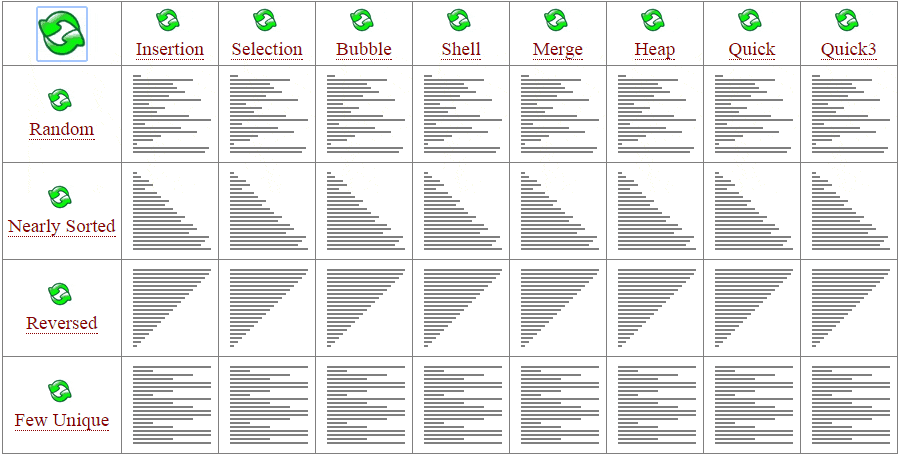

# Algorithms description

Here you can find more detailed information about particular algorithms.

A very good algorithm animations: <https://www.toptal.com/developers/sorting-algorithms>

---

**Table of Contents:**

1. [What is measured and considered](#what-is-measured-and-considered)
2. [Bubble sort](#bubble-sort)
3. [Cocktail Shaker sort](#cocktail-shaker-sort)
4. [Selection sort](#selection-sort)
5. [Insertion sort](#insertion-sort)
6. [Shell sort](#shell-sort)
7. [Counting sort](#counting-sort)
8. [Heap sort](#heap-sort)
9. [Merge sort](#merge-sort)
10. [Quick sort](#quick-sort)
11. [Papers](#papers)



[Reference](https://medium.com/@miles.pucarelli/lets-build-sorting-algorithms-in-javascript-b00d04e4a8de)

## What is measured and considered?

### Measurement

All of them are based on **Big-O Notation**.   
> Big O notation is a mathematical notation that describes the limiting behavior of a function 
when the argument tends towards a particular value or infinity.   
It's usually used to describe the time and memory complexity of algorithms.

- Time (Time complexity)
    - time is measured in nanoseconds,
    - the time complexity is the number of operations an algorithm performs to complete its task with respect to input size
      (considering that each operation takes the same amount of time). The algorithm that performs the task in the smallest number of
      operations is considered the most efficient one.
    - there are three cases to consider:
        - Best
            - This is the lower bound on running time of an algorithm. We must know the case that causes the minimum number of operations to
              be executed.
        - Average
            - Calculation the running time for all possible inputs, sum all the calculated values and divide the sum by the total number of
              inputs. The distribution of cases is known ( or predicted).
        - Worst
            - This is the upper bound on running time of an algorithm. We must know the case that causes the maximum number of operations to
              be executed.
- Memory (Space complexity)
    - used memory is measured in bytes just to prove the Big-O notation,
    - this metric shows how much memory is required by the algorithm to sort an array

| Symbol     | Description                       | Explanation (based on space complexity)                                                                          | 
|------------|-----------------------------------|------------------------------------------------------------------------------------------------------------------|
| O(1)       | constant complexity               | takes the same amount of space regardless of the input size                                                      |
| O(log n)   | logarithmic complexity            | takes space proportional to the log of the input size                                                            |
| O(n)       | linear complexity                 | takes space directly proportional to the input size                                                              |
| O(n log n) | log-linear/quasilinear complexity | also called “linearithmic”, its space complexity grows proportionally to the input size and a logarithmic factor |
| O(n^2)     | square/polynomial complexity      | space complexity grows proportionally to the square of the input size                                            |

---

The `Big O` notation is based on arithmetic sequences.

Ref: https://stackoverflow.com/questions/44252596/big-o-complexity-for-n-n-1-n-2-n-3-1

References:
- <https://www.bigocheatsheet.com/>
- <https://afteracademy.com/blog/time-and-space-complexity-analysis-of-algorithm>
- <https://www.baeldung.com/cs/space-complexity>
- <https://neetcode.io/courses/lessons/big-o-notation>

### To consider

- Stability
    - A sorting algorithm is said to be stable if two objects with equal keys appear in the same order in sorted output as they appear in
      the input array to be sorted.
    - Reference
        - https://www.baeldung.com/cs/stable-sorting-algorithms
        - https://stackoverflow.com/questions/48913820/why-selection-sort-is-unstable

```
What makes selection sort unstable is that the step of swapping a pair of elements could possibly change the relative order of another pair of elements that have equal keys. For instance, when sorting the array

2 2' 1
since the element with the minimum key is 1, you'll have to push it to the lowest position of the array by swapping 1 with 2:

1 2' 2
Swapping 1 with 2 changed the relative order of the two equal elements (2' and 2).

That is, two elements with equal keys do not appear in the same order in the sorted output as they appear in the input array. Hence, selection sort is unstable.
```

- In-place sorting
    - An in-place algorithm is an algorithm that does not need an extra space and produces an output in the same memory that contains the
      data by transforming the input ‘in-place’. However, a small constant extra space used for variables is allowed.
    - In Place
        - Bubble sort
        - Selection Sort
        - Insertion Sort
        - Heapsort
    - Not In-Place
        - Merge Sort
            - Note that merge sort requires O(n) extra space.

Reference: <https://www.geeksforgeeks.org/in-place-algorithm/>

## Bubble sort

### Description

Bubble sort is a simple sorting algorithm. 
This sorting algorithm is comparison-based algorithm in which each pair of adjacent elements 
is compared and the elements are swapped if they are not in order. 
This algorithm is not suitable for large data sets as its average 
and worst case complexity are of Ο(n2) where n is the number of items.

### Pseudocode

> Pseudocode in data science or web development is a technique 
> used to describe the distinct steps of an algorithm in a way 
> that’s easy for anyone with basic programming knowledge to understand.

> Pseudocode is not an actual programming language. So it cannot be compiled into an executable program. It uses short terms or simple English language syntaxes to write code for programs before it is actually converted into a specific programming language.

```text
bubbleSort(array)
    for i ← 0 to array.size - 1
        for j ← 0 to array.size - 1 - i
            If array[j] and array[j + 1] are not in the correct order
                Swap array[j] with array[j + 1]
```

**Optimization**

Bubble sort can be optimized by using a flag variable that exits the loop once swapping is done.  
At the end of every iteration, this flag variable is checked.   
If value is true, it means swapping happened & hence the list isn’t sorted completely so next iteration is allowed.   
If value is false, it means swapping never happened, 
hence the list is already sorted & there is no point in further iterations hence exit algorithm.  

The best complexity of a bubble sort can be O(n). O(n) is only possible if the array is sorted.

### Performance

#### Worst-case performance O(n<sup>2</sup>)

The worst case is if the array is already sorted but in descending order. This means that in the first iteration it would have to look at n
elements, then after that it would look n - 1 elements (since the biggest integer is at the end)
and so on and so forth till 1 comparison occurs. Big O = n + n - 1 + n - 2 ... + 1 = (n*(n + 1))/2 = O(n<sup>2</sup>)(approximation)

- O(n<sup>2</sup>) comparisons
- O(n<sup>2</sup>) swaps

#### Best-case performance O(n)

This time complexity can occur if the array is already sorted, and that means that no swap occurred and only 1 iteration of n elements.

- O(n) comparisons
- O(1) swaps

### Reference

- https://en.wikipedia.org/wiki/Bubble_sort
- https://www.tutorialspoint.com/data_structures_algorithms/bubble_sort_algorithm.htm
- https://www.baeldung.com/cs/bubble-sort-time-complexity

## Cocktail Shaker sort

### Description

Cocktail shaker sort, also known as bidirectional bubble sort, cocktail sort, shaker sort (which can also refer to a variant of selection
sort), ripple sort, shuffle sort, or shuttle sort, is an extension of bubble sort. The algorithm extends bubble sort by operating in two
directions. While it improves on bubble sort by more quickly moving items to the beginning of the list, it provides only marginal
performance improvements.

### Pseudocode

```text
cocktailShakerSort(array)
    for i ← 0 to array.size - 1
        for j ← 0 to array.size - 1 - i
            If array[j] and array[j + 1] are not in the correct order
                Swap array[j] with array[j + 1]
        for j ← (array.size - 1 - i) - 1 to 0
            If array[j] and array[j + 1] are not in the correct order
                Swap array[j] with array[j + 1]
```

**Optimization**

Cocktail Shaker sort can be optimized in the same way as bubble Sort by using a flag variable 
that exits the loop once swapping is done. 
The flag is reset twice - first before the second inner loop and second at the very end of the loop.

The best complexity of a shaker sort can be O(n). O(n) is only possible if the array is sorted.

### Performance

The same as the bubble sort.

### Reference

- https://en.wikipedia.org/wiki/Cocktail_shaker_sort
- https://www.geeksforgeeks.org/cocktail-sort/
- https://www.growingwiththeweb.com/2016/04/cocktail-sort.html

## Selection sort

### Description

The selection sort algorithm sorts an array by repeatedly finding the minimum element
(considering ascending order) from unsorted part and putting it at the beginning. 
The algorithm maintains two subarrays in a given array:

1) The subarray which is already sorted.
2) Remaining subarray which is unsorted.

In every iteration of selection sort, the minimum element (considering ascending order)
from the unsorted subarray is picked and moved to the sorted subarray.

### Pseudocode

```text
selectionSort(array)
    for i ← 0 to array.size - 1
        min ← i
        for j ← j + 1 to array.size
            If array[j] < array[min] then
                min ← j
        If min != i then
            Swap array[i] with array[min]
```

### Performance

#### Worst-case performance O(n<sup>2</sup>)

- O(n<sup>2</sup>) comparisons
- O(n) swaps

#### Best-case performance O(n)

- O(n<sup>2</sup>) comparisons
- O(1) swaps

### Reference

- https://www.geeksforgeeks.org/selection-sort/
- https://en.wikipedia.org/wiki/Selection_sort

## Insertion sort

### Description

Insertion sort is a simple sorting algorithm that works similar to the way you sort playing cards in your hands. The array is virtually
split into a sorted and an unsorted part. Values from the unsorted part are picked and placed at the correct position in the sorted part.

### Pseudocode

```text
insertionSort(array)
    for i ← 1 to array.size - 1
        key ← array[i]
        j ← i - 1
        while j > -1 and array[j] > key
            array[j+1] = array[j]
            j = j -1
        array[j+1] = key
```

### Performance

- The worst-case time complexity of the Insertion sort is O(n<sup>2</sup>).
- The average case time complexity of the Insertion sort is O(n<sup>2</sup>).
- The time complexity of the best case is O(n).

### Reference

- https://www.geeksforgeeks.org/insertion-sort/
- https://en.wikipedia.org/wiki/Insertion_sort
- https://www.khanacademy.org/computing/computer-science/algorithms/insertion-sort/a/insertion-sort-pseudocode
- https://www.ecb.torontomu.ca/~courses/coe428/sorting/insertionsort.html

## Shell sort

### Description

Shellsort, also known as Shell sort or Shell's method, is an in-place comparison sort. It can be seen as either a generalization of sorting
by exchange (bubble sort) or sorting by insertion (insertion sort). The method starts by sorting pairs of elements far apart from each
other, then progressively reducing the gap between elements to be compared. By starting with far apart elements, it can move some
out-of-place elements into position faster than a simple nearest neighbor exchange.

### Pseudocode

```text
shellSort(array)
    k = last/2
    loop (k not 0)
        current = k
        loop (current <= last)
            hold = list[current]
            walker = current - k
            loop (walker >= 0 AND hold < list[walker])
                list[walker+k] = list[walker]
                walker = walker - k
            end loop
            list[walker+k] = hold
            current = current + 1
        end loop
        k = k/2
    end loop
```
Ref: https://slideplayer.com/amp/3953570/

### Performance

The best case ∊ O(nlogn):

The best-case is when the array is already sorted. The would mean that the inner if statement will never be true, making the inner while loop a constant time operation. Using the bounds you've used for the other loops gives O(nlogn). The best case of O(n) is reached by using a constant number of increments.

The worst case O(n<sup>2</sup>):

Given your upper bound for each loop you get O((log n)n^2) for the worst-case. But add another variable for the gap size g. The number of compare/exchanges needed in the inner while is now <= n/g. The number of compare/exchanges of the middle while is <= n^2/g. Add the upper-bound of the number of compare/exchanges for each gap together: n^2 + n^2/2 + n^2/4 + ... <= 2n^2 ∊ O(n^2). This matches the known worst-case complexity for the gaps you've used.

The worst case Ω O(n<sup>2</sup>):

Consider the array where all the even positioned elements are greater than the median. The odd and even elements are not compared until we reach the last increment of 1. The number of compare/exchanges needed for the last iteration is Ω(n^2).

Ref: https://stackoverflow.com/questions/12767588/time-complexity-for-shell-sort

### Reference

- https://www.geeksforgeeks.org/shellsort/
- https://en.wikipedia.org/wiki/Shellsort

## Counting sort

### Description

Counting sort is a sorting technique based on keys between a specific range. 
It works by counting the number of objects having distinct key values (kind of hashing). 
Then doing some arithmetic to calculate the position of each object in the sorted output sequence.

Points to be noted:

1. Counting sort is efficient if the range of input data is not significantly greater than the number of objects to be sorted. Consider the
   situation where the input sequence is between range 1 to 10K and the data is 10, 5, 10K, 5K.
2. It is not a comparison based sorting. It running time complexity is O(n) with space proportional to the range of data.
3. It is often used as a sub-routine to another sorting algorithm like radix sort.
4. Counting sort uses a partial hashing to count the occurrence of the data object in O(1).
5. Counting sort can be extended to work for negative inputs also.

### Pseudocode

*Note that below pseudocode does not support negative numbers.*

```text
countingSort(array, size)
  count ← array of k + 1 zeros
  initialize count array with all zeros
  for i <- 0 to size
    // find the total count of each unique element and 
    count[array[i]] += 1  store the count at ith index in count array
  for i <- 1 to max
    // find the cumulative sum and store it in count array itself
    count[i] = count[i] + count[i - 1]
  for i <- size down to 1
    // restore the elements to array
    output[count[array[i]] - 1] = array[i];
    // decrease count of each element restored by 1
    count[array[i]] = count[array[i]] - 1;
```

References:
- https://www.programiz.com/dsa/counting-sort
- https://en.wikipedia.org/wiki/Counting_sort
- https://stackoverflow.com/questions/58910875/in-the-counting-sort-why-we-must-store-the-cumulative-sum-of-the-elements-of-the

### Performance

O(N+K) where N is the number of elements to be sorted and K is the number of possible values in the range. 
However, if we add first loop for searching the lowest and the highest value (the new range - M)-> O(2N+M) - time and 0(M) - memory

### Reference

- https://www.geeksforgeeks.org/counting-sort/
- https://stackoverflow.com/questions/30222523/is-counting-sort-in-place-stable-or-not

## Heap sort

### Description

Heap sort is a comparison based sorting technique based on Binary Heap data structure. 
It is similar to selection sort where we first find the maximum element and place the maximum element at the end. 
We repeat the same process for the remaining elements.

### Pseudocode

THe pseudocode adjusted to the current implementation:
```text
heapSort(arr)
    buildMaxHeap(arr)
    
    lastIdx = arr.length - 1
    rootHeapIdx = 0
    
	for (int i = lastElementIdx; i > 0; i--) 
      	swap(&arr[0], &arr[i])
	    lastIdx = lastIdx - 1
	    maxHeapify(arr, 0, lastIdx)

buildMaxHeap(arr)
	for(int i = n / 2 - 1; i >= 0; i--)
        lastIdx = arr.length - 1
        heapify(arr, i, lastIdx)

heapify(array, lastIdx, i as int)
    max = i
    leftchild = 2i + 1
    rightchild = 2i + 2
    if (leftchild <= lastIdx) and (A[i] < A[leftchild])
        max = leftchild
    else 
        max = i
    if (rightchild <= lastIdx) and (A[max]  > A[rightchild])
        max = rightchild
    if (max != i)
        swap(A[i], A[max])
        Heapify(A, n, max)
}
```

Another pseudocode:
```text
heapsort(arr)
	buildMaxHeap(arr)
	for (int i = n - 1; i >= 0; i--)
      	  swap(&arr[0], &arr[i]);
	  heapsize--;
	  maxHeapify(arr,0);

buildMaxHeap(arr)
	for(int i = n / 2 - 1; i >= 0; i--)
     		 heapify(arr, i);

heapify(arr , i)
	leftChild = arr [2*0 + 1];
	rightChild = arr [2*0 + 2];
    	maxIndex = max( arr[i], leftChild, rightChild)
    	if(i != maxIndex)
          		swap(arr[i], arr[maxIndex])
```

References: 
- https://www.mygreatlearning.com/blog/heap-sort/
- https://fullyunderstood.com/pseudocodes/heap-sort/
- https://java2blog.com/heap-sort-in-java/

### Performance

Heap Sort has O(n log n) time complexity even for the worst case.

Why? Searching a binary tree has `log n` complexity. Accordingly to the heap sort steps we can calculate complexity as:
```text
n/2 * log + n * log n (heapify all elements) = O(n log n) (approximation)
```

More details: https://neetcode.io/courses/lessons/big-o-notation

### Reference

- https://www.geeksforgeeks.org/heap-sort/
- https://en.wikipedia.org/wiki/Heapsort

## Merge sort

### Description

Like QuickSort, Merge Sort is a Divide and Conquer algorithm. 
It divides the input array into two halves, calls itself for the two halves,
and then merges the two sorted halves. 
The merge() function is used for merging two halves. 
The merge(arr, l, m, r)is a key process that assumes that arr[l..m] and arr[m+1..r] 
are sorted and merges the two sorted sub-arrays into one.

### Pseudocode

```text
mergeSort(arr)
    if ( arr.length == 1 ) return arr
    
       var l1 as array = arr[0] ... arr[n/2]
       var l2 as array = arr[n/2] ... arr[n]
    
       l1 = mergesort( l1 )
       l2 = mergesort( l2 )
    
       return merge( l1, l2 )

merge(a, b)
    var c as array
    while ( a and b have elements )
      if ( a[0] > b[0] )
         add b[0] at the beginning of c
         remove b[0] from b
      else
         add a[0] at the beginning of c
         remove a[0] from a
      end if
   end while
   
   while ( a has elements )
      add a[0] to the beginning of c
      remove a[0] from a
   end while
   
   while ( b has elements )
      add b[0] to the beginning of c
      remove b[0] from b
   end while
   
   return c
```

References: 
- https://www.tutorialspoint.com/data_structures_algorithms/merge_sort_algorithm.htm
- https://www.programiz.com/java-programming/examples/merge-sort

### Performance

- Time complexity of Merge Sort is O(n*Log n) in all the 3 cases (worst, average and best) as merge sort always divides the array in two halves and takes linear time to merge two halves.
- It requires equal amount of additional space as the unsorted array. Hence its not at all recommended for searching large unsorted arrays.
- It is the best Sorting technique used for sorting Linked Lists.

https://www.studytonight.com/data-structures/merge-sort

### Reference

- https://www.geeksforgeeks.org/merge-sort/

## Quick sort

### Description

Quicksort is a sorting algorithm based on the divide and conquer approach where
- An array is divided into subarrays by selecting a pivot element (element selected from the array).
- While dividing the array, the pivot element should be positioned in such a way that elements less than pivot are kept on the left side and elements greater than pivot are on the right side of the pivot.
- The left and right subarrays are also divided using the same approach. This process continues until each subarray contains a single element.
- At this point, elements are already sorted. Finally, elements are combined to form a sorted array.

The crucial point in QuickSort is to choose the best pivot. The middle element is, of course, the best, as it would divide the list into two equal sub-lists. But finding the middle element from an unordered list is difficult and time-consuming, that is why we take as pivot the first element, the last element, the median or any other random element.

A good animation explaining how it works: https://www.youtube.com/watch?v=PgBzjlCcFvc

### Pseudocode

```text
quickSort(array, leftmostIndex, rightmostIndex)
  if (leftmostIndex < rightmostIndex)
    pivotIndex <- partition(array,leftmostIndex, rightmostIndex)
    quickSort(array, leftmostIndex, pivotIndex - 1)
    quickSort(array, pivotIndex + 1, rightmostIndex)

partition(array, leftmostIndex, rightmostIndex)
  set rightmostIndex as pivotIndex
  storeIndex <- leftmostIndex - 1
  for i <- leftmostIndex to rightmostIndex
    if element[i] <= pivotElement
      storeIndex++
      swap element[i] and element[storeIndex]
  swap element[rightmostIndex] and element[storeIndex+1]
  return storeIndex + 1
```

References: 
- https://www.programiz.com/dsa/quick-sort
- https://www.baeldung.com/java-quicksort

### Performance

- Quick Sort Time Complexity
  - Partition of elements take n time
  - And in quicksort problem is divide by the factor 2
  - Best Time Complexity : O(nlogn)
  - Average Time Complexity : O(nlogn)
  - Worst Time Complexity : O(n^2)
  - Worst Case will happen when array is sorted
- Quick Sort Space Complexity
  - O(n) : basic approach
  - O(logn) : modified approach

Ref: https://www.mygreatlearning.com/blog/quick-sort-algorithm/

---

Break the sorting algorithm in two parts. 
First is the partitioning and second recursive call. 
Complexity of partioning is O(N) and complexity of recursive call for ideal case is O(logN). 
For example, if you have 4 inputs then there will be 2(log4) recursive call. Multiplying both you get O(NlogN). 
It is a very basic explanation.

In-fact you need to find the position of all the N elements(pivot),but the maximum number of comparisons is logN for each element (the first is N,second pivot N/2,3rd N/4..assuming pivot is the median element).

Ref: https://stackoverflow.com/questions/10425506/intuitive-explanation-for-why-quicksort-is-n-log-n

### Reference

- https://en.wikipedia.org/wiki/Quicksort
- https://www.geeksforgeeks.org/quick-sort/
- https://www.programiz.com/dsa/quick-sort
- https://www.baeldung.com/java-quicksort

## Papers

- A comparative Study of Sorting Algorithms / Comb, Cocktail and Counting Sorting
    - Reference: International Research Journal of Engineering and Technology (IRJET)
    - Date: 04 Issue: 01 | Jan‐2017

<object data="docs/papers/irjet-v4i1249-comparative-study-of-sorting-algorithms.pdf" type="application/pdf" width="700px" height="700px">
    <embed src="exercises/count-bucket-radix-sort.pdf">
        <p>This browser does not support PDFs. Please download the PDF to view it: <a href="docs/papers/irjet-v4i1249-comparative-study-of-sorting-algorithms.pdf">Download PDF</a>.</p>
    </embed>
</object>
