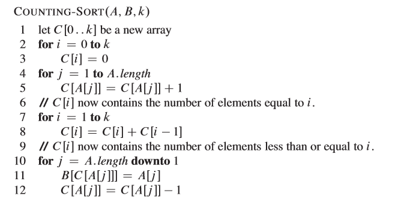
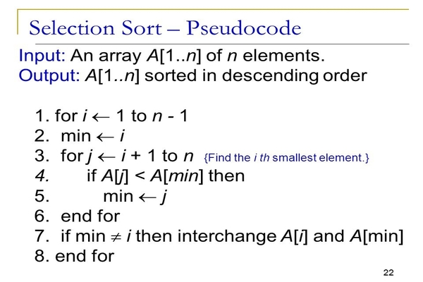
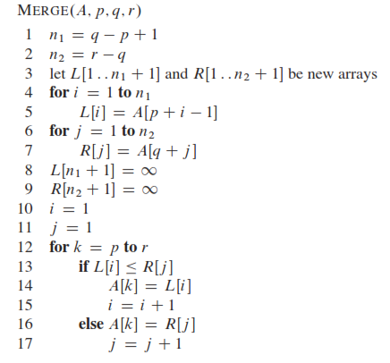
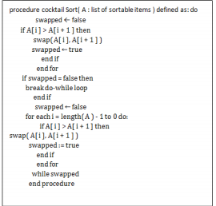
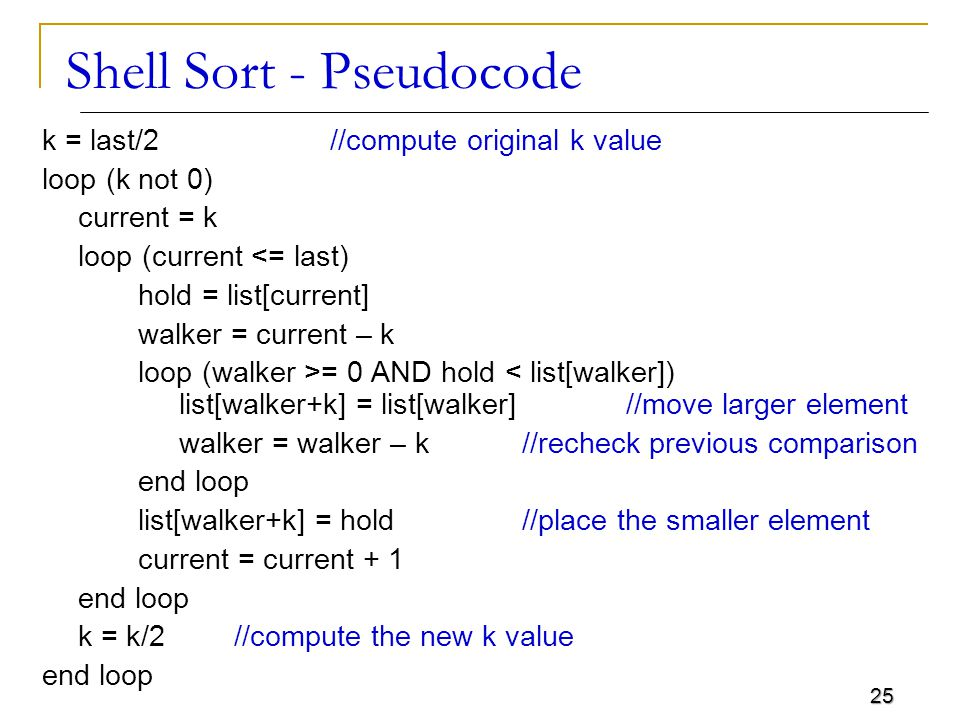

# Algorithms description

Here you can find more detailed information about particular algorithms.

1. [Bubble sort](#bubble-sort)
2. [Counting sort](#counting-sort)
3. [Heap sort](#heap-sort)
4. [Insert sort](#insert-sort)
5. [Merge sort](#merge-sort)
6. [Quick sort](#quick-sort)
7. [Selection sort](#selection-sort)
8. [Shaker sort](#shaker-sort)
9. [Shell sort](#shell-sort)

## What is measured and considered?

### Measurement

**All of them are based on Big-O Notation.**

- Time (Time complexity)
    - time is measured in nanoseconds,
    - the time complexity is the number of operations an algorithm performs to complete its task with respect to input size
      (considering that each operation takes the same amount of time). The algorithm that performs the task in the smallest number of
      operations is considered the most efficient one.
    - there are three cases to consider:
        - Best
            - This is the lower bound on running time of an algorithm. We must know the case that causes the minimum number of operations to
              be executed.
        - Average
            - Calculation the running time for all possible inputs, sum all the calculated values and divide the sum by the total number of
              inputs. The distribution of cases is known ( or predicted).
        - Worst
            - This is the upper bound on running time of an algorithm. We must know the case that causes the maximum number of operations to
              be executed.

Reference: <https://www.bigocheatsheet.com/> and <https://afteracademy.com/blog/time-and-space-complexity-analysis-of-algorithm>

- Memory (Space complexity)
    - used memory is measured in bytes just to prove the Big-O notation,
    - this metric shows how much memory is required by the algorithm to sort an array

Reference: <https://www.baeldung.com/cs/space-complexity>

| Symbol         | Description                         | Explanation (based on space complexity)                                                                                                     | 
|----------------|-------------------------------------|-------------------------------------------------------------------------------------------------------------------|
| O(1)           | constant complexity                 | takes the same amount of space regardless of the input size                                                       |
| O(log n)       | logarithmic complexity              | takes space proportional to the log of the input size                                                             |
| O(n)           | linear complexity                   | takes space directly proportional to the input size                                                               |
| O(n log n)     | log-linear/quasilinear complexity   | also called “linearithmic”, its space complexity grows proportionally to the input size and a logarithmic factor  |
| O(n^2)         | square/polynomial complexity        | space complexity grows proportionally to the square of the input size                                             |

### Consideration

- Stability
    - A sorting algorithm is said to be stable if two objects with equal keys appear in the same order in sorted output as they appear in
      the input array to be sorted.
    - Reference
        - https://www.baeldung.com/cs/stable-sorting-algorithms#:~:text=Stable%20sorting%20algorithms%20preserve%20the,unstable%20sorting%20algorithms%20don't.&text=Stable%20sorting%20maintains%20the%20order,order%20of%20the%20two%208s
        - https://stackoverflow.com/questions/48913820/why-selection-sort-is-unstable

```
What makes selection sort unstable is that the step of swapping a pair of elements could possibly change the relative order of another pair of elements that have equal keys. For instance, when sorting the array

2 2' 1
since the element with the minimum key is 1, you'll have to push it to the lowest position of the array by swapping 1 with 2:

1 2' 2
Swapping 1 with 2 changed the relative order of the two equal elements (2' and 2).

That is, two elements with equal keys do not appear in the same order in the sorted output as they appear in the input array. Hence, selection sort is unstable.
```

- In-place sorting
    - An in-place algorithm is an algorithm that does not need an extra space and produces an output in the same memory that contains the
      data by transforming the input ‘in-place’. However, a small constant extra space used for variables is allowed.
    - In Place
        - Bubble sort
        - Selection Sort
        - Insertion Sort
        - Heapsort
    - Not In-Place
        - Merge Sort
            - Note that merge sort requires O(n) extra space.

Reference: <https://www.geeksforgeeks.org/in-place-algorithm/>

## Bubble sort

### Description

Bubble sort is a simple sorting algorithm. This sorting algorithm is comparison-based algorithm in which each pair of adjacent elements is
compared and the elements are swapped if they are not in order. This algorithm is not suitable for large data sets as its average and worst
case complexity are of Ο(n2) where n is the number of items.

### Pseudocode


### Performance (additional information not included in the main benchmark table)

#### Worst-case performance O(n<sup>2</sup>)

The worst case is if the array is already sorted but in descending order. This means that in the first iteration it would have to look at n
elements, then after that it would look n - 1 elements (since the biggest integer is at the end)
and so on and so forth till 1 comparison occurs. Big Oh = n + n - 1 + n - 2 ... + 1 = (n*(n + 1))/2 = O(n<sup>2</sup>)(approximation)

- O(n<sup>2</sup>) comparisons
- O(n<sup>2</sup>) swaps

#### Best-case performance O(n)

This time complexity can occur if the array is already sorted, and that means that no swap occurred and only 1 iteration of n elements.

- O(n) comparisons
- O(1) swaps

### Reference

- https://en.wikipedia.org/wiki/Bubble_sort
- https://www.tutorialspoint.com/data_structures_algorithms/bubble_sort_algorithm.htm
- https://www.baeldung.com/cs/bubble-sort-time-complexity

## Counting sort

### Description

Counting sort is a sorting technique based on keys between a specific range. It works by counting the number of objects having distinct key
values (kind of hashing). Then doing some arithmetic to calculate the position of each object in the sorted output sequence.

Points to be noted:

1. Counting sort is efficient if the range of input data is not significantly greater than the number of objects to be sorted. Consider the
   situation where the input sequence is between range 1 to 10K and the data is 10, 5, 10K, 5K.
2. It is not a comparison based sorting. It running time complexity is O(n) with space proportional to the range of data.
3. It is often used as a sub-routine to another sorting algorithm like radix sort.
4. Counting sort uses a partial hashing to count the occurrence of the data object in O(1).
5. Counting sort can be extended to work for negative inputs also.

### Pseudocode



### Performance (additional information not included in the main benchmark table)

O(N+K) where N is the number of elements to be sorted and K is the number of possible values in the range. However, if we add first loop for
searching the lowest and the highest value (the new range - M) -> O(2N+M) - time and 0(M) - memory

### Reference

- https://www.geeksforgeeks.org/counting-sort/
- https://stackoverflow.com/questions/30222523/is-counting-sort-in-place-stable-or-not

## Selection sort

### Description

The selection sort algorithm sorts an array by repeatedly finding the minimum element
(considering ascending order) from unsorted part and putting it at the beginning. The algorithm maintains two subarrays in a given array:

1) The subarray which is already sorted.
2) Remaining subarray which is unsorted.

In every iteration of selection sort, the minimum element (considering ascending order)
from the unsorted subarray is picked and moved to the sorted subarray.

### Pseudocode



### Performance (additional information not included in the main benchmark table)

#### Worst-case performance O(n<sup>2</sup>)

- O(n<sup>2</sup>) comparisons
- O(n) swaps

#### Best-case performance O(n)

- O(n<sup>2</sup>) comparisons
- O(1) swaps

### Reference

- https://www.geeksforgeeks.org/selection-sort/
- https://en.wikipedia.org/wiki/Selection_sort

## Insertion sort

### Description

Insertion sort is a simple sorting algorithm that works similar to the way you sort playing cards in your hands. The array is virtually
split into a sorted and an unsorted part. Values from the unsorted part are picked and placed at the correct position in the sorted part.

### Pseudocode


### Performance (additional information not included in the main benchmark table)

### Reference

- https://www.geeksforgeeks.org/insertion-sort/
- https://en.wikipedia.org/wiki/Insertion_sort

## Heap sort

### Description

Heap sort is a comparison based sorting technique based on Binary Heap data structure. It is similar to selection sort where we first find
the maximum element and place the maximum element at the end. We repeat the same process for the remaining elements.

### Pseudocode


### Performance (additional information not included in the main benchmark table)

### Reference

- https://www.geeksforgeeks.org/heap-sort/
- https://en.wikipedia.org/wiki/Heapsort

## Merge sort

### Description

Like QuickSort, Merge Sort is a Divide and Conquer algorithm. It divides the input array into two halves, calls itself for the two halves,
and then merges the two sorted halves. The merge() function is used for merging two halves. The merge(arr, l, m, r) is a key process that
assumes that arr[l..m] and arr[m+1..r] are sorted and merges the two sorted sub-arrays into one. See the following C implementation for
details.

### Pseudocode



### Performance (additional information not included in the main benchmark table)

### Reference

- https://www.geeksforgeeks.org/merge-sort/

## Quick sort

### Description

Like Merge Sort, QuickSort is a Divide and Conquer algorithm. It picks an element as pivot and partitions the given array around the picked
pivot. There are many different versions of quickSort that pick pivot in different ways.

### Pseudocode


### Performance (additional information not included in the main benchmark table)

### Reference

- https://en.wikipedia.org/wiki/Quicksort
- https://www.geeksforgeeks.org/quick-sort/

## Shaker sort

### Description

Cocktail shaker sort, also known as bidirectional bubble sort, cocktail sort, shaker sort (which can also refer to a variant of selection
sort), ripple sort, shuffle sort, or shuttle sort, is an extension of bubble sort. The algorithm extends bubble sort by operating in two
directions. While it improves on bubble sort by more quickly moving items to the beginning of the list, it provides only marginal
performance improvements.

### Pseudocode



### Performance (additional information not included in the main benchmark table)

### Reference

- https://en.wikipedia.org/wiki/Cocktail_shaker_sort
- https://www.geeksforgeeks.org/cocktail-sort/

## Shell sort

### Description

Shellsort, also known as Shell sort or Shell's method, is an in-place comparison sort. It can be seen as either a generalization of sorting
by exchange (bubble sort) or sorting by insertion (insertion sort). The method starts by sorting pairs of elements far apart from each
other, then progressively reducing the gap between elements to be compared. By starting with far apart elements, it can move some
out-of-place elements into position faster than a simple nearest neighbor exchange.

### Pseudocode



### Performance (additional information not included in the main benchmark table)

### Reference

- https://www.geeksforgeeks.org/shellsort/
- https://en.wikipedia.org/wiki/Shellsort
