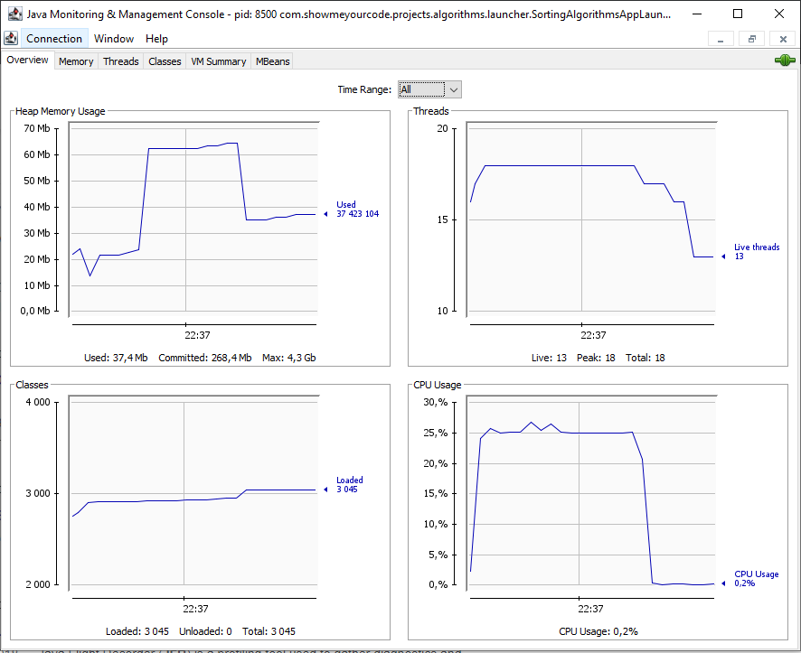

# Java Profiler

A Java Profiler is a tool that monitors Java bytecode constructs and operations at the JVM level. These code constructs and operations
include object creation, iterative executions (including recursive calls), method executions, thread executions, and garbage collections.  
<https://www.baeldung.com/java-profilers>

## Java Flight Recorder (JFR)

Java Flight Recorder (JFR) is a tool for collecting diagnostic and profiling data about a running Java application. It is integrated into
the Java Virtual Machine (JVM) and causes almost no performance overhead, so it can be used even in heavily loaded production
environments.  
<https://docs.oracle.com/javacomponents/jmc-5-4/jfr-runtime-guide/about.htm#JFRUH170>  
<https://www.baeldung.com/java-flight-recorder-monitoring>

## When should you use a Java profiler?

- **tracking down memory leaks**
  - What is a Memory Leak in Java? The standard definition of a memory leak is a scenario that occurs when objects are no longer being used
    by the application, but the Garbage Collector is unable to remove them from working memory – because they're still being referenced.
  - Standard profilers detail out all memory usage by the JVM and which classes/objects are responsible. The ability to manually run garbage
    collection and then review memory consumption can easily shine a spotlight on classes and processes that are holding on to memory in
    error.
- **tracking CPU usage**

<https://stackify.com/java-profilers-3-types/>
