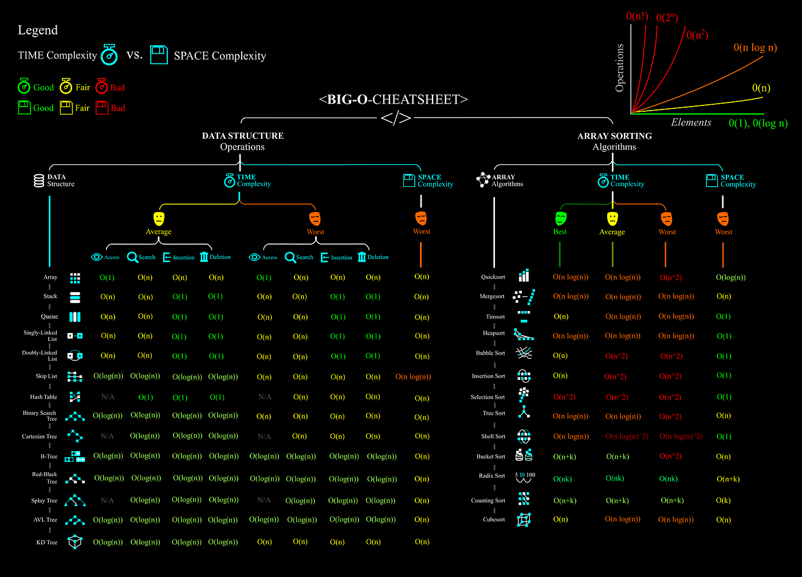
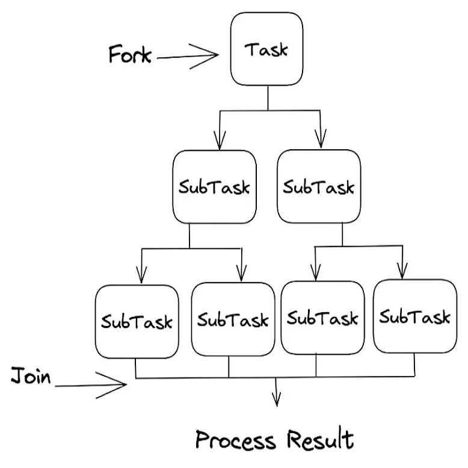
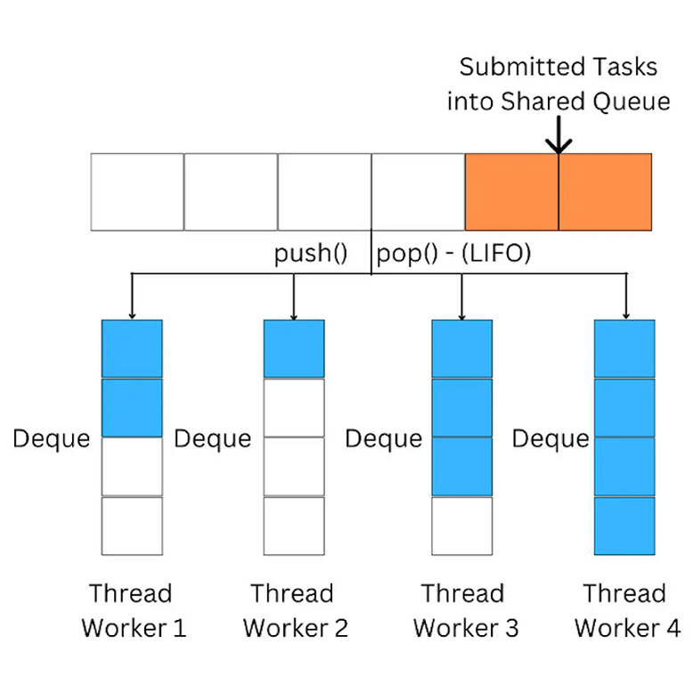
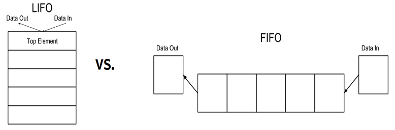
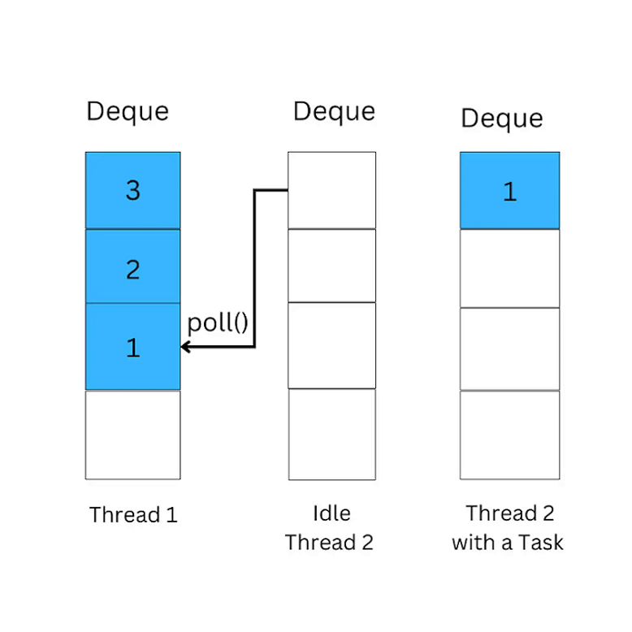
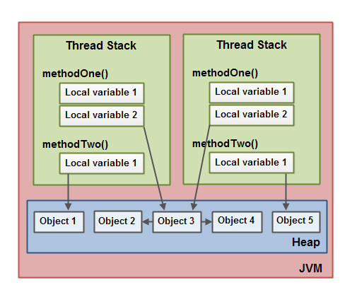

# Java sorting algorithms

*Java console application that solves a **sorting problem** which is defined as a total number of item to be sorted.*

| Branch |                                                                                               Pipeline                                                                                               |                                                                                            Code coverage                                                                                             |                                 Jacoco test report                                  |                                     PiTest report                                     |                                 SonarCloud                                 |
|:------:|:----------------------------------------------------------------------------------------------------------------------------------------------------------------------------------------------------:|:----------------------------------------------------------------------------------------------------------------------------------------------------------------------------------------------------:|:-----------------------------------------------------------------------------------:|:-------------------------------------------------------------------------------------:|:--------------------------------------------------------------------------:|
| master | [](https://gitlab.com/ShowMeYourCodeYouTube/java-sorting-algorithms/-/commits/master) | [](https://gitlab.com/ShowMeYourCodeYouTube/java-sorting-algorithms/-/commits/master) | [link](https://showmeyourcodeyoutube.gitlab.io/java-sorting-algorithms/test-report) | [link](https://showmeyourcodeyoutube.gitlab.io/java-sorting-algorithms/pitest-report) | [link](https://sonarcloud.io/organizations/showmeyourcodeyoutube/projects) |

---

- Code coverage badge on Gitlab using Maven and JaCoCo plugin | Java | JVM (YouTube video)
  - <https://www.youtube.com/watch?v=nrs-DjTRwkk>
- All algorithms' details and the benchmark explanation
  - [ALGORITHMS](./ALGORITHMS.md)
- Sorting algorithms exercises found on the Internet
  - [EXERCISES](./EXERCISES.md)

## Technology stack

- Java (AWS Corretto)
- Maven
- Lombok
- Java Microbenchmark Harness (JMH)
  - https://github.com/openjdk/jmh
- Spock & cglib
  - A good explanation how tests can be simplified using Spock: [link](https://blog.codepipes.com/testing/spock-for-java.html)
  - cglib is required for mocking non-interface types
- LogCaptor
- Java Faker
- PiTest (mutation testing)

## Getting started

1. Enable annotation processing in your IDE (required by Lombok)
2. Import this repository as Maven project.
3. Run application using a main class:

```
SortingAlgorithmsAppLauncher
```

---

In order to run JMH, run the main method of:
```
AlgorithmsMicrobenchmark
```

---

Logging levels:
- info (default)
  - general logs, no details
- debug
  - verbose output including thread's logging when running benchmark

Log levels can be changed in `logback.xml`.

## Algorithms benchmark


>An algorithm is a set of instructions designed to perform a specific task.
Sometimes an algorithm might produce a different output when given the same input.
This relates to the area of deterministic and non-deterministic algorithms.
Sorting algorithms are deterministic.

> Benchmarking is the process of evaluating the performance of algorithms by measuring their execution time, memory usage, or other relevant metrics. It involves running algorithms on standardized datasets or tasks to obtain quantitative measurements that can be used for comparison. The goal of benchmarking is to provide an objective assessment of algorithm performance and identify potential areas for improvement.

> Benchmarking allows us to compare the performance of different algorithms on specific tasks or datasets, 
enabling us to make informed decisions about which algorithm to use in a given context.

Ref: https://saturncloud.io/blog/is-the-benchmarking-of-my-algorithms-right/

| Algorithm  | 50000&#160;elements&#160;(ms)   | 100000&#160;elements&#160;(ms)    | 150000&#160;elements&#160;(ms)    | Best&#160;complexity   | Average&#160;complexity   | Worst&#160;complexity   | Space&#160;complexity&#160;(the&#160;worst)   | Stable   | In&#160;place  |
|:--------------------------------|:----------------:|:-----------------:|:-----------------:|:-----------------:|:--------------------:|:------------------:|:------------------------------:|:--------:|:---------:|
| Bubble&#160;sort |  4708  | 14287 |  29547 |  O(n)  |  O(n^2)  |  O(n^2) |  O(1) |   yes  |  yes  |
| Cocktail&#160;Shaker&#160;sort <br/> (Bidirectional&#160;bubble&#160;sort)   |  3068  | 10609 |  21491 |  O(n)  |  O(n^2)  |  O(n^2) |  O(1) |   yes  |  yes  |
| Selection&#160;sort |  1677  | 4515 |  9840 |  O(n^2)  |  O(n^2)  |  O(n^2) |  O(1) |   no  |  yes  |
| Insertion&#160;sort   |  297  | 1504 |  3422 |  O(n)  |  O(n^2)  |  O(n^2) |  O(1) |   yes  |  yes  |
| Shell&#160;sort |  7  | 17 |  25 |  O(n log n)  |  depends on gap sequence  |  O(n^2) |  O(1) |   no  |  yes  |
| Counting&#160;sort |  7  | 13 |  9 |  O(n+k)  |  O(n+k)  |  O(n+k) |  O(n+k) |   yes/no*  |  no/yes*  |
| Heap&#160;sort |  10  | 17 |  23 |  O(n log n)  |  O(n log n)  |  O(n log n) |  O(1) |   no  |  yes  |
| Merge&#160;sort |  6  | 18 |  41 |  O(n log n)  |  O(n log n)  |  O(n log n) |  O(n) |   yes  |  no  |
| Quick&#160;sort |  3  | 34 |  15 |  O(n log n)  |  O(n log n)  |  O(n^2) |  O(log n) |   no  |  yes  |

*ms - milliseconds, B - bytes, n - number of elements in an array, k - the dataset/array elements range*  
*The table is auto generated using the app. Choose `10` to generate new results and copy the table from `resources`.*

**Remarks**  
*The counting sort can be implemented as:
- not in-place: stable, O(N) space complexity,
- in-place: none stable, O(1) space complexity.

Table generated using: https://www.tablesgenerator.com/markdown_tables#  
Big O Notation reference: https://www.bigocheatsheet.com/



## ForkJoin Pool

ForkJoinPool is a thread pool that uses a divide-and-conquer strategy to execute tasks recursively. It is used by JVM languages such as Kotlin and Akka to build message-driven applications. ForkJoinPool executes tasks in parallel, enabling efficient use of computer resources. It is used extensively in Java's parallel streams and CompletableFutures, allowing developers to execute tasks concurrently with ease.



Fork Join is an implementation of ExecuterService. The main difference is that this implementation creates a **DEQUE** worker pool. Executor service creates asked number of thread, and apply a blocking queue to store all the remaining waiting task.



Another important point is that the ForkJoinPool uses deques to store tasks. This gives the ability to use either LIFO or FIFO (first-in, first-out), which is necessary for the work-stealing algorithm.

### ForkJoinTask API

- fork (asynchronous)
  - Arranges to asynchronously execute this task in the pool the current task is running in, if applicable, or using the ForkJoinPool.commonPool() if not inForkJoinPool.
- invoke (not asynchronous)
  - Commences performing this task, awaits its completion if necessary, and returns its result, or throws an (unchecked) RuntimeException or Error if the underlying computation did so.
- join
  - Returns the result of the computation when it is done.
  - Throws:
    - RuntimeException
    - Error
  * return by throwing InterruptedException.
- get
  - Returns the result of the computation when it is done.
  - Throws:
    - CancellationException – if the computation was cancelled
    - ExecutionException – if the computation threw an exception
    - InterruptedException – if the current thread is not a member of a ForkJoinPool and was interrupted while waiting

---

- ForkJoinTask : This is the abstract or the base type of all the tasks that run in the ForkJoinPool.
- RecursiveAction:  This is basically a subclass of ForkJoinTask. The main function of this class is to compute recursive actions. Remember that in the compute() method, we don't return a value. This is because the recursion happens within the compute() method.
- RecursiveTask: This class works similarly to the RecursiveAction, with the difference that the compute() method will return a value.

Both recursive classes implement `Future` interface.

### Future vs CompletableFuture

Futures were introduced in Java 5 (2004). They're basically placeholders for a result of an operation that hasn't finished yet. Once the operation finishes, the Future will contain that result. For example, an operation can be a Runnable or Callable instance that is submitted to an ExecutorService.

CompletableFutures were introduced in Java 8 (2014). They are in fact an evolution of regular Futures, inspired by Google's Listenable Futures, part of the Guava library. They are Futures that also allow you to string tasks together in a chain.

---

The main advantage of CompletableFuture over normal Future is that CompletableFuture takes advantage of the extremely powerful stream API and gives you callback handlers to chain your tasks, which is absolutely absent if you use normal Future. That along with providing asynchronous architecture, CompletableFuture is the way to go for handling computation heavy map-reduce tasks, without worrying much about application performance.

See [reference](https://stackoverflow.com/questions/35329845/difference-between-completablefuture-future-and-rxjavas-observable) 

### The work-stealing algorithm

Work-stealing in ForkJoinPool is an effective algorithm that enables efficient use of computer resources by balancing the workload across all available threads in the pool.

When a thread becomes idle, instead of remaining inactive, it will attempt to steal tasks from other threads that are still busy with their assigned work. This process maximizes the utilization of computing resources and ensures that no thread is overburdened while others remain idle.

The key concept behind the work-stealing algorithm is that each thread has its own deque of tasks, which it executes in a LIFO order.



When a thread finishes its own tasks and becomes idle, it will attempt to "steal" tasks from the end of another thread's deque, following a FIFO strategy, the same as the queue data structure. This allows the idle thread to pick up the tasks that have waited for the longest time, reducing the overall waiting time and increasing throughput.



In the following diagram, Thread 2 steals a task from Thread 1 by polling the last element from Thread 1's deque, and then executes the task. The stolen task is typically the oldest one in the deque, which ensures that the workload is evenly distributed among all threads in the pool.

### When to Use ForkJoinPool?

- Recursive tasks: ForkJoinPool is well-suited for executing recursive algorithms such as quicksort, merge sort, or binary search. These algorithms can be broken down into smaller subproblems and executed in parallel, which can result in significant performance improvements.
- Embarrassingly parallel problems: If you have a problem that can be easily divided into independent subtasks, such as image processing or numerical simulations, you can use ForkJoinPool to execute the subtasks in parallel.
- High-concurrency scenarios: In high-concurrency scenarios, such as web servers, data processing pipelines, or other high-performance applications, you can use ForkJoinPool to execute tasks in parallel across multiple threads, which can help to improve performance and

### References

- https://www.infoworld.com/article/3693752/how-to-use-forkjoinpool-in-java.html
- https://www.baeldung.com/java-fork-join
- https://www.geeksforgeeks.org/difference-between-fork-join-framework-and-executorservice-in-java/
- https://www.spiceworks.com/tech/devops/articles/fifo-vs-lifo/

## Java Memory Model (JMM)

The Java memory model specifies how the Java virtual machine works with the computer's memory (RAM).



The Java memory model used internally in the JVM divides memory between thread stacks and the heap.

Each thread running in the Java virtual machine has its own thread stack. 
The stack is used to hold return addresses, function/method call arguments, local variables and by default stack size is 512KB. It is configured with the -XX:ThreadStackSize option (-Xss on older versions).

All local variables of primitive types ( boolean, byte, short, char, int, long, float, double) are fully stored on the thread stack and are thus not visible to other threads. One thread may pass a copy of a primitive variable to another thread, but it cannot share the primitive local variable itself.

The heap contains all objects created in your Java application, regardless of what thread created the object. This includes the object versions of the primitive types (e.g. Byte, Integer, Long etc.). It does not matter if an object was created and assigned to a local variable, or created as a member variable of another object, the object is still stored on the heap.

The thread stack also contains all local variables for each method being executed (all methods on the call stack). A thread can only access it's own thread stack. Local variables created by a thread are invisible to all other threads than the thread who created it. Even if two threads are executing the exact same code, the two threads will still create the local variables of that code in each their own thread stack. Thus, each thread has its own version of each local variable.

### Visibility of Shared Objects

If two or more threads are sharing an object, without the proper use of either volatile declarations or synchronization, updates to the shared object made by one thread may not be visible to other threads.

Imagine that the shared object is initially stored in main memory. A thread running on CPU one then reads the shared object into its CPU cache. There it makes a change to the shared object. As long as the CPU cache has not been flushed back to main memory, the changed version of the shared object is not visible to threads running on other CPUs. This way each thread may end up with its own copy of the shared object, each copy sitting in a different CPU cache.


One thread running on the left CPU copies the shared object into its CPU cache, and changes its count variable to 2. This change is not visible to other threads running on the right CPU, because the update to count has not been flushed back to main memory yet.

### References

- https://www.digitalocean.com/community/tutorials/java-jvm-memory-model-memory-management-in-java
- https://jenkov.com/tutorials/java-concurrency/java-memory-model.html

## Release a new version

Run Maven commands using Maven Release plugin.
```text
mvn release:prepare
```
